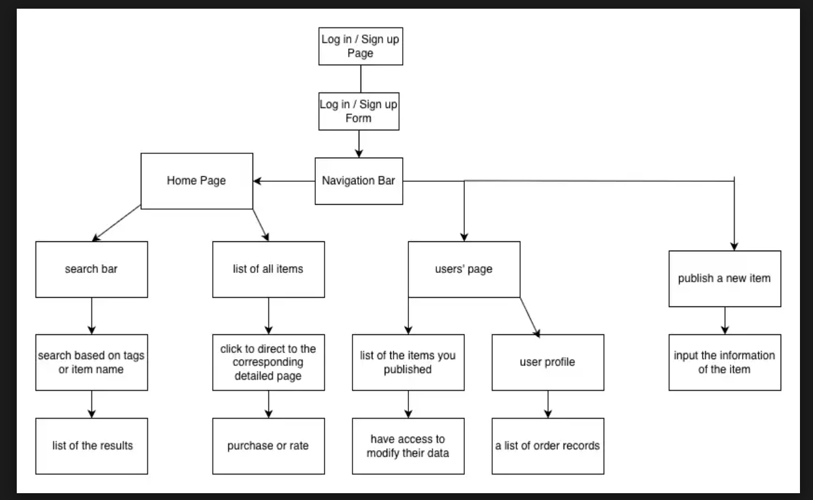
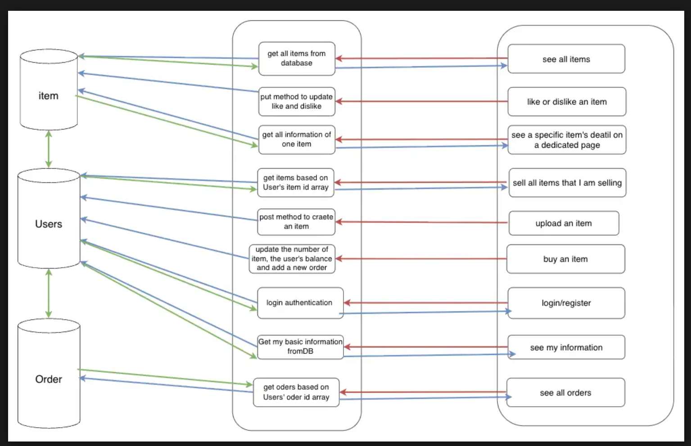

# INFO 441 Final Project: Second-Hand Trading Platform

## Project Description

This project aims to develop a comprehensive second-hand trading platform tailored for individuals looking to buy or sell unused items. Our primary target audience consists of students and community members who have idle goods they wish to monetize, as well as those seeking cost-effective shopping options. In the current market, there is a distinct need for a localized, trustworthy environment where these two groups can connect seamlessly.

Our audience wants to use this application because it simplifies the often chaotic process of peer-to-peer trading. By providing a dedicated platform with diverse categories and powerful search functionality, users can easily find specific items by category, price range, or keywords without sifting through unrelated content. Furthermore, the inclusion of a robust review and rating system addresses the critical issue of trust; buyers can assess seller reliability before committing to a purchase, and sellers are incentivized to provide quality service to build their reputation.

As developers, we are motivated to build this application to tackle the technical challenge of creating a secure, full-stack marketplace. We aim to engineer a system that not only handles complex data relationships—such as user accounts, item listings, and transaction records—but also fosters a genuine sense of community. By implementing features like user authentication, real-time data updates, and an intuitive interface, we strive to create a solution that prioritizes user experience and security, ensuring a safe environment for trading idle goods.

## Technical Description

### Architectural Diagram
The following diagram illustrates the high-level architecture of our Second-Hand Trading Platform, detailing the client, server, and database components:

### Data Flow
The diagram below demonstrates the flow of data through the system, highlighting the communication between the front-end, back-end APIs, and the MongoDB database:

### User Stories

| Priority | User | Description | Technical Implementation |
| --- | --- | --- | --- |
| **P0** | Seller | I want to create an account so I can manage my personal listings. | Use **Node.js** with **Passport.js** or **JWT** to handle user authentication and store encrypted credentials in **MongoDB**. |
| **P0** | Seller | I want to upload an item with a title, description, and price. | Implement a POST route in **Node.js** that validates input and saves the item details as a document in a **MongoDB** "listings" collection. |
| **P0** | Buyer | I want to view a list of all available items on a home page. | Create a GET endpoint that fetches all documents from the **MongoDB** listings collection and renders them via the front-end. |
| **P0** | Buyer | I want to search for items by keyword so I can find exactly what I need. | Implement **MongoDB** text indexing on the "title" and "description" fields to allow for efficient keyword-based queries via a RESTful API. |
| **P1** | Seller | I want to upload images of my items to attract more buyers. | Integrate image hosting, storing the resulting image URLs within the specific item document in **MongoDB**. |
| **P1** | Buyer | I want to filter items by category (e.g., Electronics, Furniture). | Add a category field to the schema and use **Node.js** to pass specific query parameters to the **MongoDB** .find() method. |
| **P1** | User | I want to view a specific item's details on a dedicated page. | Create a dynamic route (e.g., /items/:id) that uses the unique **MongoDB** ObjectId to fetch and display detailed information for a single listing. |
| **P1** | Seller | I want to edit or delete my existing listings. | Implement PUT and DELETE request handlers in **Node.js** that verify the user's ID matches the seller's ID before modifying the **MongoDB** entry. |
| **P2** | Buyer | I want to see a seller's average rating before I buy from them. | Use **MongoDB** aggregation pipelines to calculate the average of all "rating" values associated with a specific user ID in the reviews collection. |
| **P2** | Buyer | I want to leave a review and a star rating for a seller after a transaction. | Create a dedicated "Reviews" collection in **MongoDB** that links the reviewer ID, the seller ID, and the specific transaction ID. |
| **P2** | User | I want to update my profile information, such as my location or bio. | Use a PATCH route in **Node.js** to update specific fields in the user's document within the **MongoDB** "users" collection. |
| **P3** | User | I want to receive real-time messages from other users about an item. | Implement **Socket.io** to enable bi-directional, real-time communication between the client and the **Node.js** server without page refreshes. |
| **P3** | Buyer | I want to save items to a "Watchlist" or "Favorites" list. | Add an "array" field to the User schema in **MongoDB** that stores the ObjectIds of the items the user has favorited. |
| **P4** | User | I want to join a community forum to discuss specific item categories. | Develop a separate "Posts" collection in **MongoDB** and use **RESTful APIs** to handle threading, replies, and category tagging. |
| **P4** | User | I want to receive a notification when an item on my watchlist drops in price. | Set up a "Change Stream" in **MongoDB** or a middleware function in **Node.js** that triggers an email or alert when the price field is updated. |

### Endpoints

Below is a list of the key API endpoints our application will provide to support the user stories outlined above:

#### Authentication & Users
* `POST /auth/register` - Registers a new user account with encrypted credentials.
* `POST /auth/login` - Authenticates a user and returns a session token (JWT).
* `PATCH /api/users/:id` - Updates user profile information (e.g., bio, location).
* `GET /api/users/:id/watchlist` - Retrieves the list of items a user has favorited.
* `POST /api/users/:id/watchlist` - Adds an item to the user's watchlist.

#### Listings (Items)
* `GET /api/listings` - Retrieves a list of all available items (supports pagination).
* `POST /api/listings` - Creates a new item listing with title, description, price, and image URLs.
* `GET /api/listings/search` - Searches for items based on query parameters (e.g., `?q=keyword`, `?category=electronics`).
* `GET /api/listings/:id` - Retrieves detailed information for a specific item.
* `PUT /api/listings/:id` - Updates an existing listing (only allowed for the listing owner).
* `DELETE /api/listings/:id` - Removes a listing from the platform.

#### Reviews
* `POST /api/reviews` - Submits a new review and rating for a seller after a transaction.
* `GET /api/users/:id/rating` - Calculates and retrieves the average rating for a specific seller.

## Appendix: Database Schemas

**Users**

* `User_id` (PK) (String)
* `Balance` (Number)
* `Orders` (FK) (Array of Strings)
* `Type` (String)
* `Phone` (String)
* `Email` (String)

**Order**

* `Order_id` (PK) (String)
* `Created_date` (String)
* `Buyer_id` (FK) (String)
* `Seller_id` (FK) (String)
* `Item_id` (FK) (Array of Strings)
* `Quantity` (Number)
* `Transaction_total` (Number)
* `Status` (String)

**Item**

* `Item_id` (PK)
* `Name` (String)
* `Price` (Number)
* `Quantity_in_stock` (Number)
* `Description` (String)
* `Num_likes` (Number)
* `Num_dislikes` (Number)
* `Quantity_sold` (Number)
* `Seller_id` (FK) (String)